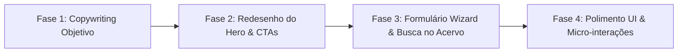

# 🚀 Planejamento de UX/UI, Storytelling e Fluxos — Novos Mensageiros

Este documento consolida o **roadmap estratégico de User Experience (UX), User Interface (UI), arquitetura de informação e copywriting objetivo** para o projeto **Novos Mensageiros**, inspirado nos melhores padrões globais de landing pages premiadas (Awwwards, Charity: Water, The Trevor Project, Headspace e Stripe/Linear).

---

## 🏆 Referências Globais & Benchmarks de UX/UI

### 1. [Charity: Water](https://www.charitywater.org/) — *Transparência e Storytelling Visual*
- **O que aprender:**
  - **Show, Don't Tell:** Utilização de imagens e dados reais que contam uma história antes mesmo do usuário ler o texto.
  - **Arquitetura em Pirâmide:** Topo da página ultra-limpo e direto. Informações detalhadas só aparecem à medida que o usuário decide explorar mais.
  - **Clareza de Impacto:** Métricas em destaque mostrando o resultado direto da ação do usuário.

### 2. [The Trevor Project](https://www.thetrevorproject.org/) — *Acolhimento de Crise & Zero Atrito*
- **O que aprender:**
  - **UX de Emergência:** Acesso em 1 clique a canais de apoio/conversa (WhatsApp/Chat) sem precisar rolar a página ou preencher formulários.
  - **Linguagem Você-Centrada:** Tom empático e direto ("Você não está sozinho", "Estamos aqui para te ouvir").
  - **Design Seguro e Acolhedor:** Cores calmas, alto contraste de leitura e navegação sem distrações.

### 3. [Headspace](https://www.headspace.com/) / [Calm](https://www.calm.com/) — *Estética Minimalista & Bem-Estar*
- **O que aprender:**
  - **Navegação por Intenção:** O usuário escolhe como se sente ou o que procura e a página se adapta.
  - **Uso Generoso de Espaço em Branco (White Space):** Evita fadiga visual e dá respiro à leitura.
  - **Cards Modulares (Bento Grid):** Organização de tópicos e materiais em blocos visuais limpos e intuitivos.

### 4. [Linear](https://linear.app/) / [Stripe](https://stripe.com/) — *Padrão Moderno de Landing Page*
- **O que aprender:**
  - **Copywriting Conciso:** Frases curtas e de alto impacto (máximo 2 linhas por parágrafo).
  - **Micro-animações com Propósito:** Elementos que ganham vida com o scroll (Framer Motion) mantendo a fluidez.

---

## 🎯 Princípios Fundamentais de UX/UI do Projeto

1. **Objetividade Absoluta (Zero Blá-Blá-Blá):**
   - Eliminar parágrafos genéricos ou repetitivos.
   - Toda seção precisa responder rapidamente a 3 perguntas:
     1. *O que é isso?*
     2. *Por que isso importa para mim?*
     3. *Qual é o próximo passo?*

2. **Arquitetura por Perfil de Usuário (Intenção de Entrada):**
   - **Perfil 1 — Necessidade de Acolhimento:** Chega em sofrimento ou busca de consolo ➔ Precisa de acesso imediato ao WhatsApp/Atendimento Fraterno.
   - **Perfil 2 — Busca por Conhecimento:** Quer entender o Espiritismo ➔ Precisa dos 5 Pilares explicados de forma simples e acesso direto a livros/vídeos em PDF.
   - **Perfil 3 — Desejo de Ajudar (Voluntário):** Quer atuar no Projeto de Resgate ➔ Precisa entender o funcionamento em 4 passos e se inscrever em 1 minuto.

3. **Design System Acolhedor e Premium:**
   - **Cores:** Azul Primário (#0080FF), Azul Céu (#00A3FF), Fundo Slate suave (#F8FAFC / #0F172A no escuro).
   - **Cards:** Bento Grid com bordas arredondadas (`rounded-2xl` / `rounded-3xl`), sombras sutis e estados de hover elegantes.
   - **Tipografia:** Fonte sans-serif moderna, peso font-bold nos títulos e leiturabilidade perfeita em telas móbiles.

---

## 📐 Propostas de Melhoria e Fluxos por Página

### 1. Portal Principal (`/`) — Novos Mensageiros

#### A. Hero Section (Primeira Impressão)
- **Título Único & Forte:** *"Doutrina Espírita e Acolhimento Fraterno ao Alcance de Todos."*
- **Subtítulo Objetivo:** *"Levamos luz, consolo e ensinamentos filosóficos de forma leve e gratuita no ambiente digital."*
- **Tripla Ação Direta (Botões por Perfil):**
  - 🟢 `Preciso de Acolhimento` ➔ Abre conversa no WhatsApp.
  - 📘 `Entender o Espiritismo` ➔ Scroll suave para os 5 Pilares.
  - 🕊️ `Quero Ajudar (Voluntariado)` ➔ Vai para a landing page do Resgate.

#### B. Seção dos 5 Princípios Básicos (Pilares)
- Apresentação em formato de **Bento Grid (3 em cima + 2 em baixo no desktop)**.
- Cada pilar com número em destaque, título em negrito e texto objetivo em 2 linhas.

#### C. Acervo de Recursos Gratuitos (Livros, Vídeos, Filmes)
- **Barra de Busca Rápida:** Digite para filtrar obras (ex: "Livro dos Espíritos", "Mayse Braga", "Nosso Lar").
- **Filtros por Abas:** *Todos*, *Livros PDF 📚*, *Palestras 🎤*, *Filmes 🎬*.
- **Padrão de Card Limpo:** Capa visual + Título + Descrição curta de 2 linhas + Botão de acesso direto.

#### D. Encontre uma Casa Espírita
- Campo de pesquisa direta por Cidade/Bairro ou link direto para a Federação Espírita Brasileira (FEB).

---

### 2. Landing Page do Projeto de Resgate (`/#/resgate`)

#### A. Hero do Resgate
- **Mensagem Direta:** *"Socorro emergencial e busca ativa de vidas no ambiente digital."*
- **Sinal de Confiança:** Card com números reais (+100 vidas amparadas, equipe multidisciplinar de voluntários).

#### B. A Jornada de Acolhimento (Linha do Tempo em 4 Passos)
- Visualização gráfica fluida em 4 etapas:
  1. 🔍 **Busca Ativa:** Mapeamento de comentários de desespero nas redes.
  2. 🛡️ **Triagem de Risco:** Análise inicial e acolhimento humano rápido.
  3. 🕊️ **Atendimento Fraterno:** Diálogo acolhedor e escuta sem julgamentos.
  4. 🏥 **Encaminhamento:** Direcionamento para Psicólogos e Casas Espíritas locais.

#### C. Formulário Inteligente de Voluntariado (Wizard em 2 Passos)
- **Passo 1:** Escolha da Frente (*Psicólogo*, *Casa Espírita*, *Voluntário Digital*, *Pesquisador*).
- **Passo 2:** Nome e WhatsApp de contato.
- **Resultado:** Redução drástica de abandono no preenchimento do formulário.

---

### 3. História e Transparência (`/#/historia`)
- Timeline interativa de crescimento dos Novos Mensageiros.
- Relatório simplificado de alcance social (+68.9k Instagram, +3.7M TikTok) e propósito da equipe.

---

## 🗓️ Roadmap de Implementação por Fases

| Fase | Foco | Ações Práticas |
| :--- | :--- | :--- |
| **Fase 1** | **Textos & Copywriting** | Revisar todos os textos do site, eliminando frases longas e ajustando a clareza. |
| **Fase 2** | **Fluxo de CTAs & Hero** | Implementar a tripla ação no Hero e ajustar a ancoragem das seções. |
| **Fase 3** | **Busca & Formulário Wizard** | Adicionar busca interativa no Acervo e transformar o cadastro de voluntários em 2 passos. |
| **Fase 4** | **Polimento de UI** | Refinar sombras, espaçamentos responsive mobile/desktop e animações Framer Motion. |

---
*Documento atualizado em 17/08/2026 com base nas melhores referências globais de UX/UI e Storytelling.*
