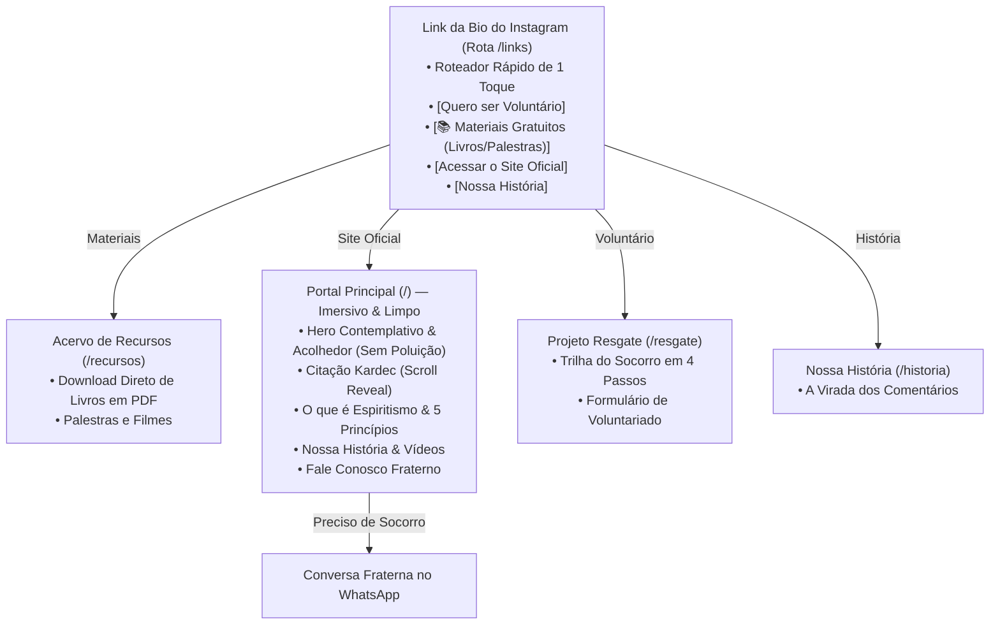

# 🗺️ Roadmap Operacional de UX, Narrativa & Motion — Novos Mensageiros
> **Documento de Aplicação Prática**  
> *Versão:* 1.0.0 | *Status:* Aprovado para execução futura (Não aplicar até liberação do usuário)  
> *Diretrizes:* Segue a skill universal [`.agents/skills/storytelling/SKILL.md`](./.agents/skills/storytelling/SKILL.md)

---

## 🎯 1. Diagnóstico e Premissas Fundamentais

1. **Público Real:** Maioria massiva mobile Android via navegador embutido do Instagram (Webview).
2. **Problema Crítico a Resolver:** Bounce Rate de 85%+ no Vercel Analytics (abandono em <3s ou saída sem navegação interna).
3. **Restrição de Segurança e Humanização Inegociável:**
   - **Zero fotos reais ou nomes completos da equipe de voluntários** (proteção contra perseguição digital, ataques e preservação da saúde emocional de quem socorre ideação suicida).
   - **Humanização via:**
     - Pacote de 4 SVGs editoriais autorais (estilo *The New Yorker / Headspace*) com micro-flutuação serena (*breeze motion*).
     - Âncora visual natural no **Bruno** (rosto e voz já conhecidos dos vídeos virais, sem formalismos desnecessários).
     - Transparência radical no protocolo de acolhimento (gratuito, sem cobrança, 100% anônimo e sigiloso).
4. **Sentido Narrativo da Jornada:** Início (Acolhimento) ➔ Meio (A Verdade & O Método) ➔ Clímax (Resgate Ativo) ➔ Fim (Ação e Conexão).

---

## 🧱 2. Estrutura Operacional e Papel de Cada Rota

---

## 📋 3. Especificação Detalhada das Fases de Implementação

### 🌿 FASE 1: Home Limpa & Contemplativa (Zero Excesso de Botões)
- **Arquivo Alvo:** `src/components/SpiritismPortal.tsx`
- **Diretriz:** **A Home NÃO é um Linktree.** Ela deve ser uma experiência de paz, serenidade e acolhimento emocional.
  1. **Hero Limpo:**
     - Apenas a headline poética, o vetor de luz celestial respirando e o botão principal acolhedor (`Falar no WhatsApp`) com um link secundário sutil (`Conhecer o Projeto`).
     - **Sem pílulas ou excesso de botões no topo da Home.** Quem quer atalhos já cai diretamente no `/links`.
  2. **Narrativa Contínua:**
     - Hero Acolhedor ➔ Respiração com a Frase de Kardec ➔ Os 5 Princípios (Arco Celeste) ➔ Quem Somos / Nossa História ➔ Fale Conosco.

---

### 🌪️ FASE 2: Ato 2 — Galeria em Espiral 3D dos Vídeos (Opção A)
- **Componente Criado:** [`src/components/VideoSpiralGallery.tsx`](./src/components/VideoSpiralGallery.tsx)
- **Tecnologia:** GSAP ScrollTrigger + CSS 3D Helix (`transform-style: preserve-3d`).
- **Comportamento:**
  - A rolagem trava a tela suavemente (`pin: true`) e gira os cards verticais dos Reels/Shorts em órbita tridimensional.
  - Cards enriquecidos com badges de views (+107k seguidores), temas reais e atalho para assistir.
- **Script Utilitário de Capas:** [`scripts/download_reels_covers.py`](./scripts/download_reels_covers.py) criado para baixar mais capas via Python.

---

### 👥 FASE 3: Ato 3 — Constelação dos Voluntários (Avatares Flutuantes)
- **Componente Criado:** [`src/components/TeamConstellation.tsx`](./src/components/TeamConstellation.tsx)
- **Conceito:**
  - Dispersão imersiva e não-linear no espaço (sem tabelas frias).
  - 5 avatares em SVG autoral no estilo traço artesanal de lápis/giz (com base no desenho fornecido pelo usuário).
  - Os 5 papéis reais da equipe:
    1. **Bruno:** A voz dos vídeos diários.
    2. **Naoki:** Arquiteto digital (código, site) e edições de vídeo.
    3. **Curadoria:** Estudos e cortes de palestras.
    4. **Design:** Posts estáticos, tipografia e arte.
    5. **Plantão Fraterno:** Escuta humana no WhatsApp na madrugada.
  - Micro-movimento de flutuação suave independente para cada membro (`breeze float`).

---

### 🌌 FASE 4: Ato 4 — Revelação Cinética Monumental em Tela Cheia
- **Componente Criado:** [`src/components/KineticCompassReveal.tsx`](./src/components/KineticCompassReveal.tsx)
- **Conceito:**
  - Travamento em tela cheia (`100vh`) com atmosfera cósmica profunda.
  - Transição de 3 fases de frases com aurora boreal sutil:
    *"Nossa missão não é impor dogmas..."* ➔ *"É a certeza de que nenhuma alma caminha sozinha..."* ➔ *“Fora da caridade não há salvação.” (Allan Kardec)*.

---

### 🎨 FASE 2: Pacote de SVGs Editoriais de Humanização Segura
- **Novo Arquivo:** `src/components/ui/EditorialIllustrations.tsx`
- **Conceito Visual:**
  - Traço fino contemporâneo, orgânico e acolhedor (estilo ilustração editorial moderna, sem cartoon infantilizado).
  - Integrado à paleta celeste (`stroke-sky-500`, preenchimentos suaves com gradiente e transparência).
- **Os 4 Vetores a Criar:**
  1. `<OuvinteAcolhedorVector />`: Silhueta serena de alguém em escuta atenta junto a outra figura, com feixe de luz tênue conectando os corações. Usado no Hero e na seção de Acolhimento.
  2. `<FarolNaEscuridaoVector />`: Figura segurando uma chama/lampião estilizado que dissipa ondas escuras. Usado na introdução da Doutrina e no Resgate.
  3. `<RedeDeMaosVector />`: Mãos estilizadas se entrelaçando em cadeia contínua de amparo. Usado no voluntariado do Resgate.
  4. `<EstudanteDaLuzVector />`: Figura lendo um livro aberto de onde emanam pequenas partículas e constelações. Usado no Acervo de Recursos.
- **Animação com Propósito:**
  - Micro-movimento de respiração (*breeze float*): `translateY: [-3px, 3px, -3px]` em ciclo suave de 7 segundos (`ease: "easeInOut"`). Não briga com a leitura.

---

### 📖 FASE 3: Seção Dedicada "O que é o Espiritismo?"
- **Arquivo Alvo:** Integrado em `src/components/SpiritismPortal.tsx` (logo antes ou integrando os 5 Princípios)
- **Estrutura de 3 Minutos de Leitura:**
  1. **O que é de verdade?**
     - *"Uma filosofia de vida consoladora e racional que nos ensina quem somos, de onde viemos e para onde vamos. Sem rituais, sem dogmas e sem cobranças."*
  2. **A Tríplice Aliança:**
     - 🔬 **Ciência:** Observação e estudo sério dos fatos da alma.
     - 💡 **Filosofia:** Respostas lógicas para o sofrimento e a existência.
     - ❤️ **Moral Cristã:** O amor e a caridade como único caminho de elevação.
  3. **Conexão Direta com os 5 Pilares:**
     - O Arco Celeste (`CelestialArcPrinciples.tsx`) ancorado como a base prática desses ensinamentos.
  4. **Acesso Imediato ao Conhecimento:**
     - Botão direto: `Baixar 'O Livro dos Espíritos' (PDF Gratuito)`.

---

### 🛡️ FASE 4: Lapidação da Trilha do Projeto de Resgate
- **Arquivo Alvo:** `src/components/RescuePortal.tsx`
- **Ajustes de Narrativa:**
  - Tornar a **Linha do Tempo dos 4 Passos** interativa com scroll-driven highlight:
    - *Passo 01: A Escuta no Barulho Digital (Busca ativa nos comentários).*
    - *Passo 02: A Triagem Fraterna (Análise de risco sem burocracia).*
    - *Passo 03: O Diálogo Seguro (WhatsApp humano, sem robôs).*
    - *Passo 04: A Ponte de Luz (Encaminhamento para psicólogos e casas espíritas).*
  - **Sinal de Confiança Máxima:** Bloco explicativo sobre ética, sigilo dos voluntários e proteção aos assistidos.

---

## 🛠️ 4. Backlog de Infraestrutura Técnica & Métricas Futuras

| Item | Objetivo | Complexidade |
| :--- | :--- | :--- |
| **Domínio Próprio** | Registrar `novosmensageiros.org.br` ou `.com.br` para passar segurança e credibilidade de instituição real. | Baixa |
| **Meta Pixel & TikTok Events** | Rastrear conversões reais de cliques no WhatsApp (`Contact`) e downloads de PDF (`Lead`), eliminando falsos bounces. | Média |
| **Vercel Analytics Custom Events** | Implementar chamadas `@vercel/analytics` nos botões para métricas limpas sem cookies. | Baixa |
| **PWA / Atalho de Aplicativo** | Permitir que o usuário adicione o portal à tela inicial do celular como um webapp leve de consolo diário. | Média |

---
*Roadmap catalogado em 15/09/2026. Pronto para execução ordenada sob comando do usuário.*
